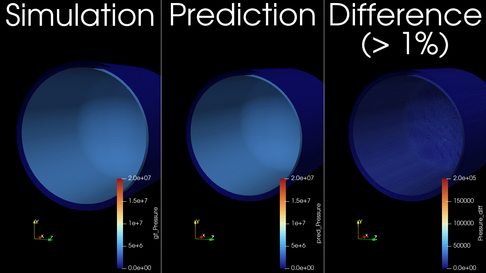
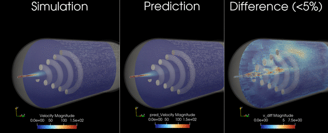

# Gas Tank Filling - Transient Conjugate Heat Transfer

The simulation workload for "tank filling" falls into two distinct categories
depending on the fluid: liquid filling (e.g., automotive fuel, water) or
high-pressure gas filling (e.g., hydrogen/CNG). While both are "filling," the
computational physics and workload challenges are completely different.

## Gas/Hydrogen Tank Filling (The "Thermal" Workload)

This is critical for the green energy industry (Hydrogen FCEVs). The challenge
here is thermodynamics, not splashing. Compressing gas into a tank generates
massive amounts of heat (heat of compression + Joule-Thomson effect).

The core physics:

* Compressible flow: Density changes drastically as pressure rises.
* Real gas models: Solvers must use complex equations of state to model how
  hydrogen behaves at high pressure.
* Conjugate heat transfer: The simulation must calculate how heat moves from
  the hot gas into the plastic liner through the carbon fiber wrapping to the
  outside air.

Computational challenges:

* Long time scales: Unlike a 3-second liquid splash, a hydrogen fill takes
  3-5 minutes. Simulating this fully in 3D is very expensive.
* Fluid-solid coupling: The solver must solve fluid equations (inside) and
  solid thermal equations (tank wall) simultaneously.

What engineers look for:

* Overheating: The tank temperature must stay within safety limits for the
  tank materials. The simulation predicts if the fill rate is too fast, causing
  the gas to get too hot.

## Liquid Tank Filling (The "Free Surface" Workload)

The primary challenge here is geometry and interface tracking. You are
simulating a heavy fluid crashing into a light fluid, creating complex
splashing, bubbling, and turbulence.

The core physics:

* Multiphase flow (VOF): Solvers use the Volume of Fluid (VOF) method to track
  the sharp interface between air and liquid. It solves a transport equation
  for the "volume fraction" in every cell.
* Turbulence: Models like k-epsilon or LES (Large Eddy Simulation) are used to
  predict how the incoming jet breaks up.

Computational challenges:

* Transient (time-dependent): The simulation must run in tiny time increments
  to capture the fluid motion accurately.
* Adaptive meshing: To see droplets and bubbles, the mesh must be incredibly
  fine at the liquid surface. Advanced solvers use Adaptive Mesh Refinement
  (AMR) to dynamically increase resolution.
* Courant number constraints: The simulation time-step is limited by the speed
  of the fluid. If the liquid moves too fast across a mesh cell, the simulation
  crashes, forcing the solver to take even smaller (more expensive) time steps.

What engineers look for:

* Blowback/splash-back: Does the fuel splash up the pipe and trigger the nozzle
  to shut off early?
* Air entrapment: Does air get trapped in "pockets" inside the tank, preventing
  it from filling to 100% capacity?

This example trains and runs a DoMINO model on transient conjugate heat transfer
simulations. Raw CFD solver dumps (VTU per timestep) are preprocessed into NPZs,
then the model predicts surface and volume fields for multiple future timesteps
in one shot. Inference can write VTKs for inspection.




## Problem Description

This use case models compressed natural gas (CNG) tank filling with optional
active cooling. The filling process is transient, compressible, and involves
conjugate heat transfer between the gas, tank wall, and cooling coil (if
present). During filling, gas compression raises temperature, which limits how
much mass can be stored and can raise thermal stress concerns. The model aims
to capture the evolving thermal and flow fields over the full fill horizon.

The dataset was generated by varying:

* Tank final pressure (200, 250, or 300 bar).
* Fill duration (60, 90, or 120 seconds).
* Inlet gas temperature (-40, -10, or 25 C).
* Cooling coil configuration (none, front, mid, back).

## Inputs, outputs, and conditioning

The model is conditioned on both geometry and global operating parameters. The
selection mirrors the quantities that materially affect compression heating and
heat transfer during a fill.

**Inputs:**

* Surface mesh from the initial timestep (`sim_0`), which encodes the tank
  geometry, internal components, and coil layout.
* Global parameters that define the fill scenario (pressure target, inlet
  temperature, duration, and coil position).

**Global parameters in this example:**

* `pressure_bar`: Final tank pressure target (e.g., 200/250/300 bar).
* `inlet_temperature_C`: Inlet gas temperature (e.g., -40, -10, 25 C).
* `run_time_s`: Fill duration (e.g., 60/90/120 s).
* `coil_position`: Categorical coil placement (0 none, 1 front, 2 mid, 3 back).

These are parsed from the simulation folder name in `process_data.py` and
provided alongside geometry to the model. If you use different parameters or a
different naming convention, update both `parse_params` and
`variables.global_parameters` in the config.

**Outputs:**

* Surface fields: pressure, temperature, wall shear stress magnitude, and heat
  flux.
* Volume fields: pressure, temperature, velocity, and heat flux.

These outputs are chosen to capture the primary thermal and flow responses of
the tank during filling, and to enable downstream calculations such as
temperature statistics, heat fluxes on internal surfaces, and flow structure
visualization. The transient horizon is predicted in one shot, meaning all
future timesteps (for example, 12-24) are produced in a single forward pass,
similar to a steady-state prediction rather than an autoregressive rollout.

## Data layout

Users can structure the data generated from their numerical solvers in the
following schema to use this recipe on their own data. The dataset used for
this example is not yet available for public training but will be released
soon.

Raw simulations (per case) are laid out as:

```text
<raw_dir>/<sim_name>/<sim_name>/
├─ sim_0/                   # initial timestep (geometry only)
│  ├─ sim_0.boundaries.vtu  # surface mesh (boundary triangles)
│  └─ FLUID0_REG0.vtu, SOLID*.vtu  # volume regions (cell-centered)
├─ sim_1/, sim_2/, ..., sim_N/   # subsequent timesteps with surface/volume fields
└─ probe_points_*.csv, inlet_*.csv, residuals.csv ... (aux files, ignored)
```

`process_data.py` traverses both levels of folders to find `sim_*` timesteps,
packs each simulation into a single NPZ, and writes scaling stats to
`<processed_dir>/stats`.

## Simulation naming and global parameters

The default preprocessing extracts global parameters from the simulation folder
name. It expects a pattern like:

```text
<prefix>_<pressure>bar_<temperature>C_<runtime>s
```

The `<prefix>` can include a coil tag (for example, `frontcoil`), which is
mapped to `variables.global_parameters.coil_position` in `conf/config.yaml`. If
your dataset uses different naming or parameters, update `parse_params` in
`process_data.py` and the `variables.global_parameters` section in the config.

## Key scripts

* `process_data.py` — preprocess raw VTU folders into NPZs
  (`<processed_dir>/train|val`) and stats. Skips sims already processed.
* `train.py` — trains DoMINO using the processed NPZs and writes
  checkpoints/tensorboard to `${project.output_root}`.
* `inference.py` — runs a trained checkpoint on raw VTU folders, writing
  per-timestep surface `.vtp` and volume `.vtu` files with `pred_*` (and optional
  `gt_*`) fields.

## Quickstart

1. Configure paths in `conf/config.yaml`, or pass overrides in the commands
   below.

1. Preprocess:

   ```bash
   python process_data.py data.raw_dir=/path/to/raw_simulations \
     data.processed_dir=/path/to/processed_npz
   ```

1. Train:

   ```bash
   python train.py data.processed_dir=/path/to/processed_npz \
     project.output_root=/path/to/outputs
   ```

   Checkpoints land in `${project.output_root}/checkpoints`; tensorboard in
   `${project.output_root}/tensorboard`.

1. Inference to VTK:

   ```bash
   python inference.py data.raw_dir=/path/to/raw_simulations \
     data.processed_dir=/path/to/processed_npz \
     inference.checkpoint=/path/to/outputs/checkpoints \
     inference.output_dir=/path/to/outputs/inference
   ```

   Writes per-timestep `surface/*.vtp` and `volume/<region>.vtu` files under
   `${inference.output_dir}/<sim_name>/`.

## Training approach (one-shot forecasting)

* Each sample uses geometry from `sim_0` and concatenates fields from
  `sim_1..sim_T` into a single target tensor.
* The target is stacked by timestep in the channel dimension, so the model
  predicts the entire horizon in one forward pass (no autoregressive rollout).
* The number of predicted steps is controlled by `data.future_steps`; smaller
  simulations are padded and masked so training still works.
* Use `model.model_type: surface | volume | combined` to control which outputs
  are trained.

## Notes and tips

* `data.val_fraction` or `data.splits.train/val` controls the train/val split.
* Multi-GPU Support: Compatible with `torchrun` or MPI for distributed training.
* Inference runs on a single GPU per process; launch multiple processes or split
  simulations to parallelize.
* `train.resume: true/false` controls checkpoint loading; default is resume.
* `train.amp: true` enables autocast + GradScaler on CUDA.
* Normalization expects stats in `<processed_dir>/stats`; missing stats will
  raise unless you disable `model.normalization`.
* Inference uses the same stats by default; override with `inference.stats_dir`
  if needed.
